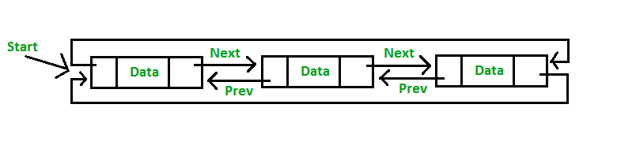

# 題目 1 + 分析

## Reference
- [2018q1 Homework (quiz4)](https://hackmd.io/@sysprog/linked-list-quiz)
- [2018q1 第 4 週測驗題](https://hackmd.io/@jserv/SyK-WApKM?type=view#%E6%B8%AC%E9%A9%97-1)

## 測驗 `1`


分析以下程式碼，推敲 `FuncA`, `FuncB`, `FuncC` 的作用，並且推測程式執行結果。

假設條件：
* `malloc` 總是成功而且返回的記憶體空間可讀寫

```c
#include <stdlib.h>
#include <stdio.h>
struct node { int data; struct node *next, *prev; };

void FuncA(struct node **start, int value) {
    if (!*start) {
        struct node *new_node = malloc(sizeof(struct node));
        new_node->data = value;
        new_node->next = new_node->prev = new_node;
        *start = new_node;
        return;
    }
    struct node *last = (*start)->prev;
    struct node *new_node = malloc(sizeof(struct node));
    new_node->data = value;
    new_node->next = *start;
    (*start)->prev = new_node;
    new_node->prev = last;
    last->next = new_node;
}

void FuncB(struct node **start, int value) {
    struct node *last = (*start)->prev;
    struct node *new_node = malloc(sizeof(struct node));
    new_node->data = value;
    new_node->next = *start;
    new_node->prev = last;
    last->next = (*start)->prev = new_node;
    *start = new_node;
}

void FuncC(struct node **start, int value1, int value2) {
    struct node *new_node = malloc(sizeof(struct node));
    new_node->data = value1;
    struct node *temp = *start;
    while (temp->data != value2)
        temp = temp->next;
    struct node *next = temp->next;
    temp->next = new_node;
    new_node->prev = temp;
    new_node->next = next;
    next->prev = new_node;
}

void display(struct node *start) {
    struct node *temp = start;
    printf("Traversal in forward direction \n");
    for (; temp->next != start; temp = temp->next)
	    printf("%d ", temp->data);
    printf("%d ", temp->data);
    printf("\nTraversal in reverse direction \n");
    struct node *last = start->prev;
    for (temp = last; temp->prev != last; temp = temp->prev)
	printf("%d ", temp->data);
    printf("%d ", temp->data);
    printf("\n");
}

int main() {
    struct node *start = NULL;
    FuncA(&start, 51); FuncB(&start, 48);
    FuncA(&start, 72); FuncA(&start, 86);
    FuncC(&start, 63, 51);
    display(start);
    return 0;
}
```

<mark>作答區</mark>

`FuncA` 的作用是
* `(a)` 偵測輸入是否為 circular linked list，若是則將現有所有節點內容排序，否則不做事 
* `(b)` 建立兩個節點並且安插在結尾，內容都是 `value`
* `(c)` 尋找所有節點，當遇到符合給定數值 `value` 的節點時，將 circular linked list 的開頭和剛找到的節點串接
* `(d)` 建立新節點，內容是 `value`，並安插在開頭
* `(e)` 建立新節點，內容是 `value`，並安插在結尾
* `(f)` 建立兩個節點並且安插在開頭，內容都是 `value`

> `Ans` : (e)

`FuncB` 的作用是
* `(a)` 偵測輸入是否為 circular linked list，若是則將現有所有節點內容排序，否則不做事 
* `(b)` 建立兩個節點並且安插在結尾，內容都是 `value`
* `(c)` 尋找所有節點，當遇到符合給定數值 `value` 的節點時，將 circular linked list 的開頭和剛找到的節點串接
* `(d)` 建立新節點，內容是 `value`，並安插在開頭
* `(e)` 建立新節點，內容是 `value`，並安插在結尾
* `(f)` 建立兩個節點並且安插在開頭，內容都是 `value`

> `Ans` : (d)

`FuncC` 的作用是
* `(a)` 偵測輸入是否為 circular linked list，若是則將現有所有節點內容排序，否則不做事 
* `(b)` 建立兩個節點並且安插在結尾，內容分別是 `value1` 和 `value2`
* `(c)` 建立兩個節點並且安插在開頭，內容分別是 `value1` 和 `value2`
* `(d)` 找到節點內容為 `value2` 的節點，並在之前插入新節點，內容為 `value1`
* `(e)` 找到節點內容為 `value2` 的節點，並在之後插入新節點，內容為 `value1`
* `(f)` 找到節點內容為 `value1` 的節點，並在之前插入新節點，內容為 `value2`
* `(g)` 找到節點內容為 `value1` 的節點，並在之後插入新節點，內容為 `value2`
* `(h)` 尋找所有節點，當遇到符合給定數值 `value1` 和 `value2` 的兩個節點時，將這兩個找到的節點相互串接

> `Ans` : (e)

在程式輸出中，訊息 `Traversal in forward direction` 後依序印出哪幾個數字呢？

Z1 = ?
* `(a)` 63
* `(b)` 86
* `(c)` 51
* `(d)` 48
* `(e)` 72
* `(f)` 這個程式有缺陷，無法正確輸出數字

> `Ans` : (d)

Z2 = ?
* `(a)` 63
* `(b)` 86
* `(c)` 51
* `(d)` 48
* `(e)` 72
* `(f)` 這個程式有缺陷，無法正確輸出數字

> `Ans` : (c)

Z3 = ?
* `(a)` 63
* `(b)` 86
* `(c)` 51
* `(d)` 48
* `(e)` 72
* `(f)` 這個程式有缺陷，無法正確輸出數字

> `Ans` : (a)

Z4 = ?
* `(a)` 63
* `(b)` 86
* `(c)` 51
* `(d)` 48
* `(e)` 72
* `(f)` 這個程式有缺陷，無法正確輸出數字

> `Ans` : (e)

Z5 = ?
* `(a)` 63
* `(b)` 86
* `(c)` 51
* `(d)` 48
* `(e)` 72
* `(f)` 這個程式有缺陷，無法正確輸出數字

> `Ans` : (b)

在程式輸出中，訊息 `Traversal in reverse direction` 後依序印出哪幾個數字呢？

Z6 = ?
* `(a)` 63
* `(b)` 86
* `(c)` 51
* `(d)` 48
* `(e)` 72
* `(f)` 這個程式有缺陷，無法正確輸出數字

> `Ans` : (b)

Z7 = ?
* `(a)` 63
* `(b)` 86
* `(c)` 51
* `(d)` 48
* `(e)` 72
* `(f)` 這個程式有缺陷，無法正確輸出數字

> `Ans` : (e)

Z8 = ?
* `(a)` 63
* `(b)` 86
* `(c)` 51
* `(d)` 48
* `(e)` 72
* `(f)` 這個程式有缺陷，無法正確輸出數字

> `Ans` : (a)

Z9 = ?
* `(a)` 63
* `(b)` 86
* `(c)` 51
* `(d)` 48
* `(e)` 72
* `(f)` 這個程式有缺陷，無法正確輸出數字

> `Ans` : (c)

Z10 = ?
* `(a)` 63
* `(b)` 86
* `(c)` 51
* `(d)` 48
* `(e)` 72
* `(f)` 這個程式有缺陷，無法正確輸出數字

> `Ans` : (d)

```{seealso}
延伸題目：
* 在上述 doubly-linked list 實作氣泡排序和合併排序，並提出需要額外實作哪些函示才足以達成目標
* 引入統計模型，隨機新增和刪除節點，然後評估上述合併排序程式的時間複雜度和效能分佈 (需要製圖和數學分析)
```
---

## 測驗 `2`


考慮以下程式碼，推敲程式作用並分析輸出。
假設條件：
* `malloc` 總是成功而且返回的記憶體空間可讀寫
* `malloc()` 得到的地址成嚴格單調遞增函數

```c
#include <stdio.h>
#include <stdlib.h>

/* Link list node */
struct node { int data; struct node *next; };

int FuncX(struct node *head, int *data) {
    struct node *node;
    for (node = head->next; node && node != head; node = node->next)
        data++;
    return node - head;
}

struct node *node_new(int data) {
    struct node *temp = malloc(sizeof(struct node));
    temp->data = data; temp->next = NULL;
    return temp;
}

int main() {
    int count = 0;
    struct node *head = node_new(0);
    head->next = node_new(1);
    head->next->next = node_new(2);
    head->next->next->next = node_new(3);
    head->next->next->next->next = node_new(4);
    printf("K1 >> %s\n", FuncX(head, &count) ? "Yes" : "No");
    head->next->next->next->next = head;
    printf("K2 >> %s\n", FuncX(head, &count) ? "Yes" : "No");
    head->next->next->next->next->next = head->next;
    printf("K3 >> %s\n", FuncX(head, &count) ? "Yes" : "No");
    head->next = head->next->next->next->next->next->next->next->next;
    printf("K4 >> %s\n", FuncX(head, &count) ? "Yes" : "No");
    printf("K5 >> %d\n", head->next->data);
    printf("count >> %d\n", count);
    return 0;
}
```

<mark>作答區</mark>

`FuncX` 的作用是 (涵蓋程式執行行為的正確描述最多者)
* `(a)` 走訪 circular linked list 所有節點，計算節點數量並更新
* `(b)` 走訪 circular linked list 所有節點，計算節點數量並更新，回傳最後一個節點和開頭的地址距離 (offset)
* `(c)` 走訪 circular linked list 所有節點，回傳最後一個節點和開頭的地址距離 (offset)
* `(d)` 判斷是否為 circular linked list，若為 circular 則回傳非零值，其他回傳 `0`
* `(e)` 判斷是否為 circular linked list，若為 circular 則回傳 `0`，其他非零值
* `(f)` 判斷是否為 circular linked list，若為 circular 則回傳 `0`，其他非零值，過程中計算走訪的節點總數
* `(g)` 判斷是否為 circular linked list，若為 circular 則回傳非零值，其他回傳 `0`，過程中計算走訪的節點總數

> `Ans` : (e)

`K1 >>` 後面接的輸出為何
* `(a)` No
* `(b)` Yes

> `Ans` : (b)

`K2 >>` 後面接的輸出為何
* `(a)` No
* `(b)` Yes

> `Ans` : (a)

`K3 >>` 後面接的輸出為何
* `(a)` No
* `(b)` Yes

> `Ans` : (a)

`K4 >>` 後面接的輸出為何
* `(a)` No
* `(b)` Yes

> `Ans` : (a)

`K5 >>` 後面接的輸出為何
* `(a)` 5
* `(b)` 4
* `(c)` 3
* `(d)` 2
* `(e)` 1
* `(f)` 0

> `Ans` : (f)

`count >>` 後面接的輸出為何
* `(a)` 5
* `(b)` 4
* `(c)` 3
* `(d)` 2
* `(e)` 1
* `(f)` 0

> `Ans` : (f)