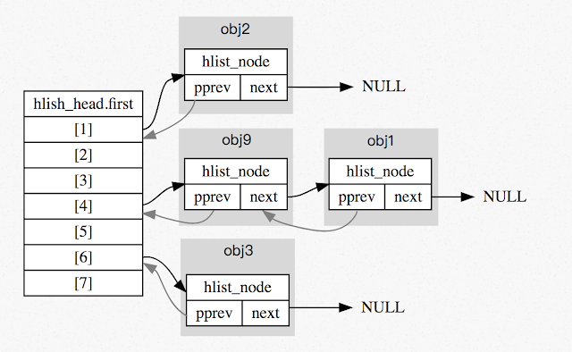
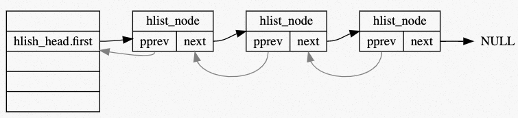

# 題目5 / 參考題解

## Reference
- [2022q1 第 1 週測驗題](https://hackmd.io/@sysprog/linux2022-quiz1)
- [2022q1 Homework1 (quiz1)](https://hackmd.io/@qwe661234/linux2022-quiz1)

## 測驗 `1`

[LeetCode](https://leetcode.com/) 編號 1 的題目 [Two Sum](https://leetcode.com/problems/two-sum/)，貌似簡單，作為 LeetCode 的開篇之題，乃是經典中的經典，正所謂「平生不識 [Two Sum](https://leetcode.com/problems/two-sum/)，刷盡 [LeetCode](https://leetcode.com/) 也枉然」，就像英語單詞書的第一個單詞總是 [Abandon](https://www.dictionary.com/browse/abandon) 一樣，很多沒有毅力堅持的人就只能記住這一個單詞，所以通常情況下單詞書就前幾頁有翻動的痕跡，後面都是[嶄新如初](https://en.wikipedia.org/wiki/Mint_condition)，道理不需多講，雞湯不必多灌，明白的人自然明白。
> 以上說法取自 [Two Sum 兩數之和](https://www.cnblogs.com/grandyang/p/4130379.html)
> [mint condition](https://en.wikipedia.org/wiki/Mint_condition): "mint" 除了薄荷的意思，還可指鑄幣廠，"mint condition" 裡的 “mint” 就與鑄幣廠有關。有些人收集錢幣會在錢幣剛開始發行時收集，因爲這樣的錢幣看起來很新，他們會用 "mint condition" 來形容這種錢幣的狀況，強調「像剛從鑄幣廠出來」，後來衍伸出「有如新一樣的二手商品」的意涵。

題意是給定一個陣列 `nums` 和一個目標值 `target`，求找到 `nums` 的 2 個元素相加會等於 target 的索引值。題目確保必為單一解，且回傳索引的順序沒差異。例如給定輸入 `nums = [2, 7, 11, 15]`, `target = 9`，相加變成 `9` 的元素僅有 `2` 及 `7`，因此回傳這二個元素的索引值 `[0, 1]`

考慮以下 C 語言實作:
```cpp
#include <stdlib.h>
static int cmp(const void *lhs, const void *rhs) {
    if (*(int *) lhs == *(int *) rhs)
        return 0;
    return *(int *) lhs < *(int *) rhs ? -1 : 1;
}

static int *alloc_wrapper(int a, int b, int *returnSize) {
    *returnSize = 2;
    int *res = (int *) malloc(sizeof(int) * 2);
    res[0] = a, res[1] = b;
    return res;
}

int *twoSum(int *nums, int numsSize, int target, int *returnSize)
{
    *returnSize = 2;
    int arr[numsSize][2];  /* {value, index} pair */
    for (int i = 0; i < numsSize; ++i) {
        arr[i][0] = nums[i];
        arr[i][1] = i;
    }
    qsort(arr, numsSize, sizeof(arr[0]), cmp);
    for (int i = 0, j = numsSize - 1; i < j; ) {
        if (arr[i][0] + arr[j][0] == target)
            return alloc_wrapper(arr[i][1], arr[j][1], returnSize);
        if (arr[i][0] + arr[j][0] < target)
            ++i;
        else
            --j;
    }
    *returnSize = 0;
    return NULL;
}
```

若用暴力法，時間複雜度為 $O(n^2)$，顯然不符合期待。我們可改用 [hash table](https://en.wikipedia.org/wiki/Hash_table) (以下簡稱 `HT`) 記錄缺少的那一個值 (即 `target - nums[i]`) 和對應的索引。考慮以下案例:
> nums = `[2, 11, 7, 15]`：

對應的步驟:
1. `nums[0]` 是 `2`，`HT[2]` 不存在，於是建立 `HT[9 - 2] = 0`
2. `nums[1]`是 `11`， `HT[11]` 不存在，於是建立 `HT[9 - 11] = 1`
3. `nums[2]` 是 `7`，`HT[7]` 存在 (設定於步驟 `1`)，於是回傳 `[2,  HT[7]] = [2, 0]`



`hlist` 用於 hash table 的實作，它的資料結構定義在 [include/linux/types.h](https://github.com/torvalds/linux/blob/master/include/linux/types.h) 中:
```cpp
struct hlist_head {
    struct hlist_node *first;
};

struct hlist_node {
    struct hlist_node *next, **pprev;
};
```

示意如下:


`hlist` 的操作與 `list` 一樣定義於 [include/linux/list.h](https://github.com/torvalds/linux/blob/master/include/linux/list.h)，以 `hlist_` 開頭。`hlist_head` 和 `hlist_node` 用於 hash table 中 bucket 的實作，具有相同 hash value 的節點會放在同一條 `hlist` 中。 為了節省空間，`hlist_head` 只使用一個 `first` 指標指向 `hlist_node`，沒有指向串列尾節點的指標。

`hash table` 主要是由一個 `hlist_head` 的動態陣列所構成，每個 entry 指向一個由 `struct hlist_node` 構成的非環狀 doubly linked list ，hash table 長度依照 `bits` 給定，可知大小為 2 的冪。

而可以發現 `struct hlist_head` 只有一個 `struct hlist_node *` 的成員; 而 `struct hlist_node` 型態卻包含一個 `struct hlist_node *` 及 `struct hlist_node **` ，其中一個原因為 hash table 指向的為非環狀的 linked list ，因此只需指向 list 的一端點，若單純使用 `struct hlist_node` 當作 head ，無用的 "pprev" 會造成大量的記憶體空間浪費，因此將 head 與 node 分開來實做。

而 `struct hlist_node` 中的 pprev 為何使用「指標的指標」而非「指標」？ 回答這個問題前可以先參考 Linux 原始碼中 [type.h](https://gist.github.com/ian910297/d03edc271105854a0cc3fcf68c1cb527) ：

```c
struct list_head {
	struct list_head *next, *prev;
};

struct hlist_head {
	struct hlist_node *first;
};

struct hlist_node {
	struct hlist_node *next, **pprev;
};
```

可知在 type.h 中有兩種 list 的結構： 

`struct list_head` 在 Linux 中實作為環狀 doubly-linked list，且可以在行程管理 (process scheduling) 的相關實做上看到，如 [sched.h](https://github.com/torvalds/linux/blob/master/include/linux/sched.h) 中有近 20 處使用到此結構，因可快速存取到頭以及尾的節點（時間複雜度 $O(1)$） 故有較好的效能，適用於行程管理這種對時間要求嚴謹的部分做使用。

引用自 linux [sched.h](https://github.com/torvalds/linux/blob/master/include/linux/sched.h)
```c
struct sched_entity {
    /* For load-balancing: */
    struct load_weight  load;
    struct rb_node      run_node;
    struct list_head    group_node;
    unsigned int        on_rq;
    ...
}
```

struct `hlist_head` 搭配 `hlist_node`。在 Linux 核心中專門為了 hash table 而使用，`hlist_head` 的設計也省去了 list 起始端 `pprev` 的存放空間、在初始狀態就省去了一半的記憶體容量。而且同時 hash table 不會特別需要存取到 list 的尾端，並且走訪 list 相對沒那麼講求效率（因為 hash 的設計理念就是講求 hash collision rate 要低、因此一個 list 若太長比較需要改進的為 hash function 的設計而非改進整個資料結構）。綜合上述所說單向 list 已滿足 hash table 的需求。

 **`pprev` 為何是「指標的指標」**？若和 `list_head` 一樣使用單純的指標( `hlist_node *`)，則考慮到 list 有方向性，delete node 時需要額外檢查其是否為 list 的 head 或是 NULL 等等，有較冗餘的程式碼必須實做，因此使用 `hlist_node **pprev` 直接存取上一個 node 所在的位址。Linux 為求程式碼簡潔故以 pointer to pointer 的方式用 `pprev` 直接指向前一個元素的記憶體位址本身。 

以下是引入 [hash table](https://en.wikipedia.org/wiki/Hash_table) 的實作，學習 Linux 核心程式碼風格:
```cpp
#include <stddef.h>
#include <stdlib.h>

struct hlist_node { struct hlist_node *next, **pprev; };
struct hlist_head { struct hlist_node *first; };
typedef struct { int bits; struct hlist_head *ht; } map_t;

#define MAP_HASH_SIZE(bits) (1 << bits)

map_t *map_init(int bits) {
    map_t *map = malloc(sizeof(map_t));
    if (!map)
        return NULL;

    map->bits = bits;
    map->ht = malloc(sizeof(struct hlist_head) * MAP_HASH_SIZE(map->bits));
    if (map->ht) {
        for (int i = 0; i < MAP_HASH_SIZE(map->bits); i++)
            (map->ht)[i].first = NULL;
    } else {
        free(map);
        map = NULL;
    }
    return map;
}

struct hash_key {
    int key;
    void *data;
    struct hlist_node node;
};

#define container_of(ptr, type, member)               \
    ({                                                \
        void *__mptr = (void *) (ptr);                \
        ((type *) (__mptr - offsetof(type, member))); \
    })

#define GOLDEN_RATIO_32 0x61C88647
static inline unsigned int hash(unsigned int val, unsigned int bits) {
    /* High bits are more random, so use them. */
    return (val * GOLDEN_RATIO_32) >> (32 - bits);
}

static struct hash_key *find_key(map_t *map, int key) {
    struct hlist_head *head = &(map->ht)[hash(key, map->bits)];
    for (struct hlist_node *p = head->first; p; p = p->next) {
        struct hash_key *kn = container_of(p, struct hash_key, node);
        if (kn->key == key)
            return kn;
    }
    return NULL;
}

void *map_get(map_t *map, int key)
{
    struct hash_key *kn = find_key(map, key);
    return kn ? kn->data : NULL;
}

void map_add(map_t *map, int key, void *data)
{
    struct hash_key *kn = find_key(map, key);
    if (kn)
        return;

    kn = malloc(sizeof(struct hash_key));
    kn->key = key, kn->data = data;

    struct hlist_head *h = &map->ht[hash(key, map->bits)];
    struct hlist_node *n = &kn->node, *first = h->first;
    AAA;
    if (first)
        first->pprev = &n->next;
    h->first = n;
    BBB;
}

void map_deinit(map_t *map)
{
    if (!map)
        return;

    for (int i = 0; i < MAP_HASH_SIZE(map->bits); i++) {
        struct hlist_head *head = &map->ht[i];
        for (struct hlist_node *p = head->first; p;) {
            struct hash_key *kn = container_of(p, struct hash_key, node);
            struct hlist_node *n = p;
            p = p->next;

            if (!n->pprev) /* unhashed */
                goto bail;

            struct hlist_node *next = n->next, **pprev = n->pprev;
            *pprev = next;
            if (next)
                next->pprev = pprev;
            n->next = NULL, n->pprev = NULL;

        bail:
            free(kn->data);
            free(kn);
        }
    }
    free(map);
}

int *twoSum(int *nums, int numsSize, int target, int *returnSize)
{
    map_t *map = map_init(10);
    *returnSize = 0;
    int *ret = malloc(sizeof(int) * 2);
    if (!ret)
        goto bail;

    for (int i = 0; i < numsSize; i++) {
        int *p = map_get(map, target - nums[i]);
        if (p) { /* found */
            ret[0] = i, ret[1] = *p;
            *returnSize = 2;
            break;
        }

        p = malloc(sizeof(int));
        *p = i;
        map_add(map, nums[i], p);
    }

bail:
    map_deinit(map);
    return ret;
}
```

請補完程式碼。

<mark>作答區</mark>

AAA = ?
* `(a)` `/* no operation */`
* `(b)` `n->pprev = first`
* `(c)` `n->next = first`
* `(d)` `n->pprev = n`

> `Ans` : (c)

BBB = ?
* `(a)` `n->pprev = &h->first`
* `(b)` `n->next = h`
* `(c)` `n->next = n`
* `(d)` `n->next = h->first`
* `(e)` `n->next = &h->first`

> `Ans` : (a)

```{seealso}
延伸題目:
1. 解釋上述程式碼運作原理
2. 研讀 Linux 核心原始程式碼 [include/linux/hashtable.h](https://github.com/torvalds/linux/blob/master/include/linux/hashtable.h) 及對應的文件 [How does the kernel implements Hashtables?](https://kernelnewbies.org/FAQ/Hashtables)，解釋 hash table 的設計和實作手法，並留意到 [tools/include/linux/hash.h](https://github.com/torvalds/linux/blob/master/tools/include/linux/hash.h) 的 `GOLDEN_RATIO_PRIME`，探討其實作考量
```

---

## 測驗 `2`

針對 LeetCode [82. Remove Duplicates from Sorted List II](https://leetcode.com/problems/remove-duplicates-from-sorted-list-ii/)，以下是可能的合法 C 程式實作:
```c
#include <stddef.h>

struct ListNode {
    int val;
    struct ListNode *next;
};

struct ListNode *deleteDuplicates(struct ListNode *head)
{
    if (!head)
        return NULL;

    if (COND1) {
        /* Remove all duplicate numbers */
        while (COND2)
            head = head->next;
        return deleteDuplicates(head->next);
    }

    head->next = deleteDuplicates(head->next);
    return head;
}
```

請補完程式碼，注意作答規範:
* `|`, `||`, `&`, `&&` 作為 logical/bitwise operator 時，應該要跟 operand 有一個空白字元區隔，也就是 `A | B` 和 `C && D` 的形式
* `COND1` 和 `COND2` 中「不要」出現小括號，也就是 `(` 和 `)`
* `->` 前後不要出現空白，也就是應該寫作 `ptr->next` 而非 `ptr -> next`
* `=` 和 `==` 前後要有空白，也就是寫作 `A == B` 和 `C = 1`
* `COND1` 和 `COND2` 不包含 `;`, `:`, `?` 等符號
* 儘量寫出最精簡的程式碼，而且答案也只接受符合上述程式碼排版風格的最精簡形式

> `COND1`: `head->val == head->next->val`

> `COND2`: `head->val == head->next->val`

```{seealso}
延伸問題:
1. 嘗試避免遞迴，寫出同樣作用的程式碼
2. 以類似 Linux 核心的 circular doubly-linked list 改寫，撰寫遞迴和迭代 (iterative) 的程式碼
```

---

## 測驗 `3`

針對 LeetCode [146. LRU Cache](https://leetcode.com/problems/lru-cache/)，以下是 [Least Recently Used](https://en.wikipedia.org/wiki/Cache_replacement_policies#Least_recently_used_(LRU)) (LRU) 可能的合法 C 程式實作:
```c
#include <stdio.h>
#include <stdlib.h>
#include "list.h"

typedef struct {
    int capacity, count;             
    struct list_head dhead, hheads[];
} LRUCache;
    
typedef struct {
    int key, value;
    struct list_head hlink, dlink;
} LRUNode;

LRUCache *lRUCacheCreate(int capacity)
{   
    LRUCache *obj = malloc(sizeof(*obj) + capacity * sizeof(struct list_head));
    obj->count = 0;
    obj->capacity = capacity;
    INIT_LIST_HEAD(&obj->dhead);
    for (int i = 0; i < capacity; i++)
        INIT_LIST_HEAD(&obj->hheads[i]);
    return obj;
}
    
void lRUCacheFree(LRUCache *obj)
{       
    LRUNode *lru, *n;
    MMM1 (lru, n, &obj->dhead, dlink) {
        list_del(&lru->dlink);
        free(lru);
    }
    free(obj); 
}   

int lRUCacheGet(LRUCache *obj, int key)
{
    LRUNode *lru;
    int hash = key % obj->capacity;
    MMM2 (lru, &obj->hheads[hash], hlink) {
        if (lru->key == key) {
            list_move(&lru->dlink, &obj->dhead);
            return lru->value;
        }
    }
    return -1;
}

void lRUCachePut(LRUCache *obj, int key, int value)
{
    LRUNode *lru;
    int hash = key % obj->capacity;
    MMM3 (lru, &obj->hheads[hash], hlink) {
        if (lru->key == key) {
            list_move(&lru->dlink, &obj->dhead);
            lru->value = value;
            return;
        }
    }

    if (obj->count == obj->capacity) {
        lru = MMM4(&obj->dhead, LRUNode, dlink);
        list_del(&lru->dlink);
        list_del(&lru->hlink);
    } else {
        lru = malloc(sizeof(LRUNode));
        obj->count++;
    }
    lru->key = key;
    list_add(&lru->dlink, &obj->dhead);
    list_add(&lru->hlink, &obj->hheads[hash]);
    lru->value = value;
}
```

請補完程式碼，注意作答規範:
* `MMM1`, `MMM2`, `MMM3`, `MMM4` 都是 Linux 核心風格的 list 巨集，以 `list_` 開頭
* 不要出現空白
* 儘量寫出最精簡的程式碼，而且答案也只接受符合上述程式碼排版風格的最精簡形式

> `MMM1`: `list_for_each_entry_safe` or `list_for_each_entry_safe_reverse`

> `MMM2`: `list_for_each_entry` or `list_for_each_entry_reverse`

> `MMM3`: `list_for_each_entry` or `list_for_each_entry_reverse`

> `MMM4`: `list_last_entry`

```{seealso}
延伸問題:
1. 解釋上述程式碼的運作，撰寫完整的測試程式，指出其中可改進之處並實作
2. 在 Linux 核心找出 LRU 相關程式碼並探討
```

---

## 測驗 `4`

針對 LeetCode [128. Longest Consecutive Sequence](https://leetcode.com/problems/longest-consecutive-sequence/description/)，以下是可能的合法 C 程式實作:
```c
#include <stdio.h>
#include <stdlib.h>
#include "list.h"

struct seq_node {
    int num;
    struct list_head link;
};                                                                                                                                                            
            
static struct seq_node *find(int num, int size, struct list_head *heads)
{   
    struct seq_node *node;
    int hash = num < 0 ? -num % size : num % size;
    list_for_each_entry (node, &heads[hash], link) {
        if (node->num == num)
            return node;
    }
    return NULL;
}

int longestConsecutive(int *nums, int n_size)
{
    int hash, length = 0;
    struct seq_node *node;
    struct list_head *heads = malloc(n_size * sizeof(*heads));

    for (int i = 0; i < n_size; i++)
        INIT_LIST_HEAD(&heads[i]);

    for (int i = 0; i < n_size; i++) {
        if (!find(nums[i], n_size, heads)) {
            hash = nums[i] < 0 ? -nums[i] % n_size : nums[i] % n_size;
            node = malloc(sizeof(*node));
            node->num = nums[i];
            list_add(&node->link, &heads[hash]);
        }
    }

    for (int i = 0; i < n_size; i++) {
        int len = 0;
        int num;
        node = find(nums[i], n_size, heads);
        while (node) {
            len++;
            num = node->num;
            list_del(&node->link);

            int left = num, right = num;
            while ((node = find(LLL, n_size, heads))) {
                len++;
                list_del(&node->link);
            }

            while ((node = find(RRR, n_size, heads))) {
                len++;
                list_del(&node->link);
            }

            length = len > length ? len : length;
        }
    }

    return length;
}
```

請補完程式碼

LLL = ?
* `(a)` `left`
* `(b)` `left++`
* `(c)` `++left`
* `(d)` `left--`
* `(e)` `--left`

RRR = ?
* `(a)` `right`
* `(b)` `right++`
* `(c)` `++right`
* `(d)` `right--`
* `(e)` `--right`

:::success
延伸問題:
1. 解釋上述程式碼的運作，撰寫完整的測試程式，指出其中可改進之處並實作
2. 嘗試用 Linux 核心風格的 hash table 重新實作上述程式碼
:::