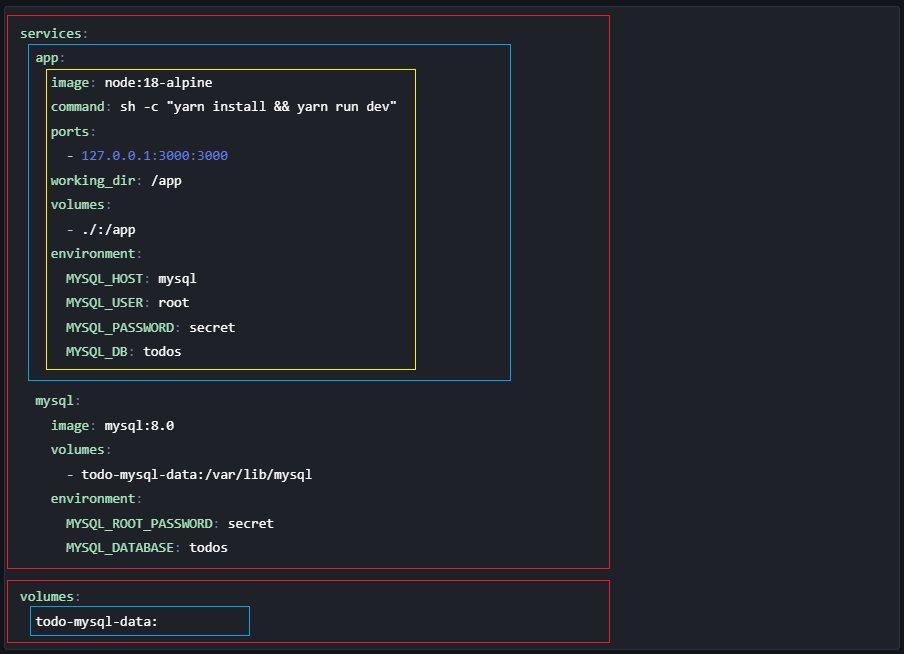

# Docker Tutorial

## 目錄

- [什麼是 Docker 與 Docker 基礎概念](#什麼是-docker-與-docker-基礎概念)
- [Image 管理](#image-管理)
- [Dockerfile 介紹](#dockerfile-介紹)
- [docker-compose.yml 介紹](#docker-composeyml-介紹)
- [進階觀念](#進階觀念)

## 什麼是 Docker 與 Docker 基礎概念

### 什麼是 Docker

Docker 的定位很接近`虛擬機(Virtual Machine)`，它提供一個輕量級、隔離的環境，可用來編譯原始碼、執行應用程式、進行測試等。不過相較於傳統的虛擬機，Docker 更加輕量，對系統資源的負擔也較小（因為與 host 共用 kernel），而且部署與使用方式也相對簡單。

Docker 有幾個重要的基本概念：

- Image
- Container
- Volume
- Network

### Image

Image 可以想像成系統的快照，封裝了執行環境所需的所有依賴與設定，能夠重現特定的執行狀態。比較重要的特點是 Image 是唯讀的檔案，只能整體重建，不能做部分修改。

#### Image 相關指令

```bash
docker images --help
docker image rmi --help
```

### Container

Container 是 Image 的實體化，兩者的關係就像物件導向裡的`類別`與`實體`的關係。
舉例來說，`ubuntu` 是一個 Image，我們可以透過 `docker run -it ubuntu` 來啟動一個基於該 Image 的 Container。

#### Container 相關指令

```bash
docker ps --help
docker run --help
    -it, -d, -p, -e,  -P,  --env-file,  --mount
docker stop --help
docker start --help
docker exec --help
docker create --help
docker rm --help
    -f
```

### Docker Volume

Docker Volume 的設計是為了讓 Container 可以持久化儲存資料。由於 Image 本身是唯讀的，若程式會產生資料（例如資料庫的儲存檔），這些資料應該被存放在 Volume 中，才能在 Container 停止或刪除後仍保留。

#### Docker Volume 相關指令

```bash
docker volume create --help
docker volume ls --help
docker volume rm --help
docker volume prune --help
```

### Docker Network

Docker Network 允許 Container 之間的網路溝通，並與 Host 的網路隔離。這樣設計有助於提高安全性與可管理性，也能支援多 Container 應用部署架構（如微服務）。

#### Docker Network 相關指令

```bash
docker network ls --help
docker network create --help
docker network inspect --help
```

## Image 管理

要啟動 container 之前必須先有一個 image 。要如何建立 image ? 可以使用指令來建立，也可以從網路上的 `Registry` 取得現成的 image 。  

### 快照指令

我們可以使用指令將`執行中`的 container 快照下來，轉換成一個新的 image。

```bash
docker commit --help
```

### Dockerfile

我們使用指令可以搭配 `Dockerfile` 來建立。Dockerfile 就像是個食譜，用來描述要如何建立一個 image 。

#### Dockerfile 相關指令

```bash
docker build --help
    -t,  --target,  --no-cache
```

### Registry

若將 Dockerfile 想像成建構 Image 的`食譜`，那 Registry 就是存放各種已建構好 Image 的`倉庫`。
最常見的 Registry 是 [Docker Hub](https://hub.docker.com/)，我們可以從中搜尋、下載，甚至推送自定義的 image。
在實務上我們可能會用 `git repository` 去對單一食譜做版本控制。我們通常會搭配 `tag` 機制，將相同應用的不同版本清楚標示在 Registry 中，方便團隊或使用者拉取特定版本的 Image。

#### Registry 相關指令

```bash
docker tag --help

docker search --help
docker pull --help
docker push --help
```

## Dockerfile 介紹

標準的 Dockerfile 架構有下面幾個部分

- Stage (如下圖紅色框框部分)
- Base Image (如下圖藍色框框部分)
- Layer (如下圖黃色框框部分)


### Layer

每一個 `Layer` 會對應到建構環境要使用的操作指令，例如 `RUN`, `ENV`, `ARG`, `USER` 等。有哪些指令以及各自的功能可以參考 [Dockerfile reference](https://docs.docker.com/reference/dockerfile/) 。

在建構過程中，Docker 會為每個 Layer 建立 cache，以便在下次建構時重複使用未改變的層級，加快建構速度。 Docker 在 build 的時候會自動檢查是否可以套用 cache 來加快速度，但如果想要強制不使用 cache 的話可以在 build 指令加入 `OPTIONS` 或者直接使用指令把 cache 清除之後再重建。

#### Cache 相關指令

```bash
docker builder prune --help
```

### Base Image

每個 Stage 都需指定一個 `Base Image`，作為該階段的基礎執行環境。它實際上是最底層的一個 Layer，後續的 Layer 都是在此基礎上進行修改與擴充。

### Stage

Dockerfile 的 stage 主要是將 image 的建構分階段。每一個階段都可以是一個獨立的 image ，但預設只有最後一個 stage 的 image 會被產生。

會使用 multi-stage 的原因通常是因為要精簡 image 的 size 。下面是一個官方提供的範例:  
你要從原始碼開始搭建一個實際運行的 container ，因此需要先做編譯，接著再佈署。 有些工具是只有在編譯時有需要但執行時不需要。例如`編譯 c 與 c++ 程式的 gcc` 、 `編譯 Java 的 JDK`。因此可以在 stage 1 安裝這些工具並且執行編譯，接著在 stage 2 使用 `COPY` 指令把 stage 1 編譯出來的結果複製進來並安裝相關會使用到的工具。

## docker-compose.yml 介紹

在官方的 turtioral 裡面有提到，**每一個 container 應該要努力做好一件小事，而不是完成一件大事**。最簡單的例子就是架設一個 web 網站。通常 web 網站最少會需要一個`前後端 server` 以及一個 `資料庫`。 官方建議將功能拆分成多個 Container，每個 Container 各自負責單一職責，例如前端伺服器與資料庫分別運作於不同 Container 中。但如果要這樣做的話會有一個問題是不同 Container 之間的通訊要自己手動設定，這是個麻煩且容易出錯的工作。在這個使用場景之下可以使用 `Docker Compose` 來解決這個問題。

經典的 docker-compose.yml 的結構有以下部分

- 類別定義 (下圖紅色框部分)
- 物件定義 (下圖藍色框部分)
- 屬性定義 (下圖黃色框部分)



### 類別定義

這些定義會對應到常見的 Docker 資源類別。例如：

- `services` 對應到 `docker container`
- `volumes` 對應到 `docker volume`
- `networks` 對應到 `docker network`

其他可定義的類別如下

- networks
- configs
- secrets
- name
- profiles
- extensions (x-...)

### 物件定義

根據類別定義出實體，例如圖片上的 `services` 類別裡面會有 `app` 與 `mysql` 兩個物件，這兩個物件會對應到兩個獨立的 `container` 。而 `volumes` 類別裡面的 `todo-mysql-data` 則是對應到一個 Docker Volume。

### 屬性定義

這些屬性定義對應的是你使用 `docker run` 或 `docker volume create` 指令時所指定的的 `OPTIONS` 。用來設定物件的設定。

### Docker Compose 相關指令

```bash
docker compose up --help
     --build, -d
docker compose run --help
docker compose start --help
docker compose down --help
docker compose build --help
    -build-arg
```

## 進階觀念

### Container 的 mount

container 的 mount 有兩種模式

- mount `Docker Volume`
- bind mount

第一種方式就如名稱所示，是把指定的路徑綁訂到某個 Docker Volume 上。  
第二種方式則是類似建立一個捷徑把 `container` 指定的路徑連接到 `host` 的指定路徑。  

常見的使用場景如下:

- 將 project directory 綁訂到 container 某個路徑下面
- 將 ~/.git 的設定綁訂到 container 的 ${HOME_DIR}/.git 或 /root/.git 下面
- 將 ~/.ssh 的設定綁訂到 container 的 ${HOME_DIR}/.ssh 或 /root/.ssh 下面

在使用 `docker run` 的時候可以使用 `-v <source>:<target>[:<mode>]` 的 `OPTION` 來指定 mount 。預設狀況是使用 mount Docker Volume 的方式去解讀，但如果 source 是使用`絕對路徑 (不可以使用相對路徑)`來描述的話會視作為 bind mount 。

### docker-compose 的 network

前面的介紹有提到，使用 `Docker Compose` 的目的是要隔離大型應用的每一個部分，但 container 之間又要能互相通訊。這實際上是依靠建立 `Docker Network` 並且在 `docker run` 的時候使用 `--network <network>` 把所有的 container 連接到同一個網路來解決。如果使用了 Docker Compose 的方式的話在執行的時候 Docker 會自動建立一個對應的的 `bridge` 網路 `<project_name>_default` 。沒有指定網路設定的 service 預設就會連接到這個網路因此可以互相通訊，但如果有指定網路的 service 如果沒有指定到同一個網路的話彼此之間就無法通訊。

### Docker security

#### Docker 啟動的步驟以及安全機制

1. 由 Docker Engine 呼叫 `containerd`，再透過 `runc` 建立 container
   - Docker 使用 containerd 作為 container 執行與生命週期管理的中介，再透過符合 OCI 標準的 runtime (預設為 runc ) 來啟動實際的 container process。
2. 建立 Linux namespaces，隔離 container 資源，包括:
   - Process
   - Network
   - File system
   - User
   - IPC
3. 根據 image 的 layer 結構，使用 overlay filesystem 組合成 container 的 root filesystem，同時根據 volumes 或 bind mounts 的設定，將指定的目錄掛載至 container 內的對應路徑。
4. 使用 Linux 的 `cgroups` 限制 CPU / Memory 使用量
5. 使用 Linux 的 `seccomp` 屏蔽高風險的 `systemcall`

Docker 之所以能提供相對安全的執行環境，主要是因為在啟動 container 時，會為 container 的各項資源建立獨立的 Linux namespaces，使其運作與 host 系統相互隔離。

#### Docker 的安全隱患

在未啟用 `User Namespace Remapping` 的情況下， container 內部的 root 使用者（UID 0）在 host 上也是真正的 root，兩者幾乎擁有相同權限。
雖然 Docker 預設會移除一些高風險的 Linux capabilities（例如 `CAP_SYS_ADMIN`, `CAP_NET_ADMIN`），因此 container 內的 root 無法執行某些操作（如掛載檔案系統、修改網路介面等），但這仍無法完全避免風險。若在 `docker run` 的時候加上了 `--privileged` OPTION，則 container 將會被賦予所有 capabilities，並解除 AppArmor、seccomp 等限制。此時 container 內的 root 就與 host 的 root 幾乎無異，擁有完整權限。這代表 container 中的 process 可以掛載 host 上的檔案系統，例如將 `/root` 或 `/etc` 掛載進 container 中，造成系統安全重大風險。

### Linux capabilities 與 Docker 權限控制

在某些情況下，應用程式可能需要執行系統層級的操作，例如修改網路設定、調整系統時間，或掛載檔案系統。傳統的 Linux 權限模型僅有一個超級使用者 `root` ，因此若要執行上述操作，通常必須以 root 權限執行程式，這容易導致權限過度開放與安全風險。

從 Linux 2.2 開始，系統引入了 `Linux Capabilities` 機制，將原本屬於 root 的權限細分為多個 `能力模組(capabilities)`。我們可以將特定的 capability 授予某個 process，使其能執行特定的系統操作，而不需要完整的 root 權限。例如，`CAP_NET_ADMIN` 允許修改網路設定，`CAP_SYS_TIME` 允許修改系統時間等。

這些 capability 是附加在 process 上，執行檔雖可透過 `setcap` 指定 capability，但最終生效的是執行時的 process。詳細說明可參考官方文件：[capabilities(7) — Linux manual page](https://man7.org/linux/man-pages/man7/capabilities.7.html) 。

當使用 `docker run` 啟動 container 的時候，如果加上 `--cap-add` 的 `OPTION` 的話 container 的 process 會被賦予對應的 capability 。在 container 裡面 fork 的任何 process 都會自動繼承這些 capabilities 。因此，透過該選項賦予的 capability 將套用至整個 container 中所有的 process。

#### Linux Capabilities 相關指令

```bash
setcap --help
getcap --help

getpcaps --help
man capsh
```

## 接下來?

這篇文章的主要目的是幫助你理解如何閱讀與理解別人的 `Dockerfile` 和 `docker-compose.yml`。在不同的應用場景中，會需要不同的設定方式；即使是相同的需求，也可能有多種實現方式，因此學會閱讀別人的設定檔，能幫助你更快上手與應變。

接下來的建議學習方式是：找一些實際的 `Dockerfile` 和 `docker-compose.yml` 範例，動手分析它們的寫法與用途，觀察各種指令與欄位的使用差異，並試著親自執行看看。

如果在過程中遇到不懂的設定項目或指令，不妨善用像是 ChatGPT 這類 AI 工具，或參考官方文件來查詢說明。透過大量實作與查詢，會讓你越來越熟悉 Docker 的生態與使用習慣。

## Reference

- [dockerdocs - Get started](https://docs.docker.com/get-started/)
- [dockerdocs - Manuals](https://docs.docker.com/manuals/)
- [capabilities(7) — Linux manual page](https://man7.org/linux/man-pages/man7/capabilities.7.html)
- [Why Running Docker Containers as Root is a Security Nightmare (And How to Fix It)](https://medium.com/@ayoubseddiki132/why-running-docker-containers-as-root-is-a-security-nightmare-and-how-to-fix-it-83a60509d9bf)
