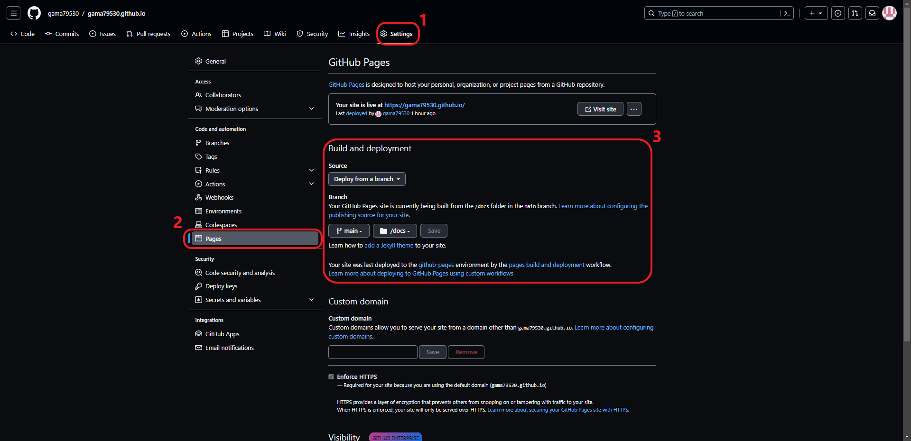

# 網站架構

## 開發環境

1. Ubuntu 22.04 LTS
2. Python 3.10.12
3. sphinx-book-theme
4. MyST-NB (MyST is included)

### 安裝指令

```bash
pip install sphinx-book-theme
pip install sphinx-copybutton
pip install sphinx-togglebutton
pip install myst-nb
pip install jupyter
pip install matplotlib
pip install pandas
```

或者可以使用我提供的 `requirement.txt` 來安裝。

```bash
pip install -r requirement.txt
```

```{tip}
:class: dropdown
可以用下面的指令來建立獨立的 virtual environment 。

```bash
python3 -m venv venv
source venv/bin/activate
```

## 設置環境

### 初始化環境

使用下面的指令將 project 初始化

```bash
sphinx-quickstart
rm -rf source/index.rst
```

```{caution}
使用指令之後會有 5 個步驟如下:

1. Separate source and build directories (y/n) [n]:
2. Project name:
3. Author name(s):
4. Project release []:
5. Project language [en]:

如果要照我的教學實做的話第一個選項必須要是 **y** 。
其它 4 個選項可以依照需求去選。此外，這 4 個選項之後也可以在指令產出的 **conf.py** 去修改設定 
```

### 設定 conf.py

完整的設定可以參考這個 Project 的 [conf.py](https://github.com/gama79530/gama79530.github.io/blob/main/source/conf.py) 。下面會一段一段解釋一些設定。

#### 設定要使用的外掛套件

``` python
    extensions = [
        "sphinx_copybutton",
        "sphinx_togglebutton",
        "myst_nb",
        "sphinx.ext.graphviz", 
    ]
```

#### 設定 html 相關的選項

``` python
   html_theme = 'sphinx_book_theme'
   
   html_logo = "_static/{your logo}"
   html_title = "{your title}"

   html_theme_options = {
        "use_download_button": True,
        "use_source_button": True,
        "use_edit_page_button": True,
        "use_repository_button": True,
        "use_issues_button": True,
        "repository_provider": "{your-provider}",
        "repository_url": "https://{your-provider}/{org}/{repo}",
        "repository_branch": "main",
        "path_to_docs": "source"
   }
```

```{note}
1. `html_logo` 與 `html_title` 是用來對左側 sidebar 做客製化的設定，可以參考 [Customize your left sidebar](https://sphinx-book-theme.readthedocs.io/en/stable/tutorials/get-started.html#customize-your-left-sidebar)

2. 設定 `use_download_button` 讓你可以下載這個網頁的 markdown 原始碼。可以參考 [Add a download page button](https://sphinx-book-theme.readthedocs.io/en/stable/components/download.html)

3. 其它的設定與 remote repository 相關的設定。 可以參考 [Buttons that link to source files](https://sphinx-book-theme.readthedocs.io/en/stable/components/source-files.html#)
```

#### 設定 myst

這個外掛是讓 Sphinx 可以使用 `.md` 作為 source 。

```python
myst_enable_extensions = [
    "amsmath",
    "colon_fence",
    "deflist",
    "dollarmath",
    "html_image",
]

myst_url_schemes = ("http", "https", "mailto")
myst_number_code_blocks = ['c', 'c++', 'java', 'python', 'html', 'css', 'javascript', 'bash']
myst_heading_anchors = 4
```

```{note}
1. `myst_url_schemes` 這個設定是用來設定哪些格式會被判定為外部連結，可以參考 [Set URL scheme defaults ‼️](https://myst-parser.readthedocs.io/en/latest/develop/_changelog.html#set-url-scheme-defaults)

2. 其它相關的設定可以參考 [Global configuration](https://myst-parser.readthedocs.io/en/latest/configuration.html)
```

#### 設定 myst-nb

這個外掛是讓 Sphinx 可以使用 `.ipynb` 作為 source 。

```python
number_source_lines = True
nb_number_source_lines = True
```

```{note}
1. 這兩個設定是讓 code cell 可以顯示行數，更多相關設定可以參考 [Configuration](https://myst-nb.readthedocs.io/en/latest/configuration.html#rendering)
```

#### 設定 graphviz

這個設定會影響當用 `Graphviz` 畫圖時所用的格式

```python
graphviz_output_format = "svg"
```
```{note}
1. 關於 `graphviz_output_format` 更多的說明可以參考 [sphinx.ext.graphviz](https://www.sphinx-doc.org/en/master/usage/extensions/graphviz.html#confval-graphviz_output_format)
```

## 發布內容

### 設定 GitHub Pages

參考下面圖這張圖設定 github 的 repository



### 使用 project 提供的 makefile 指令發布

#### 清除之前產出的相關檔案

```bash
make clean
```

#### 產出檔案到 build 方便預覽

```bash
make preview
```

可以從 `build/html/index.html` 作為首頁去預覽

#### 產出要上傳到 github 發布的檔案

```bash
make publish
```
