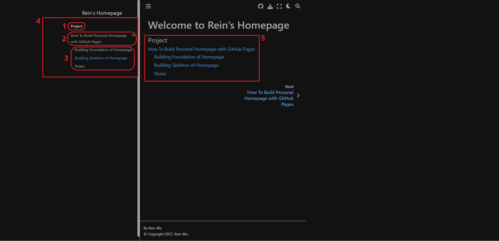

# 網頁架構

## 設定左側的 sidebar

主要可以設定的選項

- `html_logo`
- `html_title`

詳細說明可以參照 [official turtioral](https://sphinx-book-theme.readthedocs.io/en/latest/tutorials/get-started.html#customize-your-left-sidebar)   
更多細緻的選項可以參照 [Control the left sidebar items](https://sphinx-book-theme.readthedocs.io/en/latest/sections/sidebar-primary.html#sidebar-primary-items)

## 增加內容在 margin content

```{margin} Look, some margin content!
On wider screens, this content will pop out to the side!
```

````md
```{margin} Look, some margin content!
On wider screens, this content will pop out to the side!
```
````

這一段示範了 margin content 是什麼以及語法，須注意的是 margin content 的內容會對其後續的主要內容。詳細說明可以參考 [Add some margin content to a page](https://sphinx-book-theme.readthedocs.io/en/latest/tutorials/get-started.html#add-some-margin-content-to-a-page)

## 建立網站的網頁框架

### 首頁



上面的圖片是首頁的圖片，對應到的檔案為 `source/index.md` 。 首頁同是所有 `toctree` 的 `root` ，同時每個 `toctree` 都由`屬性` 與 `子頁面` 組成 。  

圖片上編號 4 紅色框顯示了我的網站是由一個兩層的 toctree 構成。這個 toctree 包含了

- 標題: 編號 1 紅色框
- level 1 頁面: 編號 2 紅色框
- level 2 頁面: 編號 3 紅色框

```{note}
- 一個網站可以由任意數量個 toctree 組成.
- 一個 toctree 可以有多個 level 1 的子頁面
- level i 的子頁面可以有任意數量個 level i+1 的子頁面。
```

### toctree

基本的 `toctree` 語法如下

````md
```{toctree}  
<properties>
...

<children pages>
...

```
````


上面的圖片展示了我的網站首頁的 toctree 內容以及對應到的檔案 `source/index.md`

- toctree 的標題
- toctree 高度為 2。
- 一個子頁面 `homepage/index`

```{tip}
編號 5 紅色框的部份只要定義了 toctree 就會自動產生，如果不想要的話可以加上 `:hidden:` 屬性。
```


接著需要定義 level 1 的頁面，從上面的圖片以及更前面首頁的圖片可以看到這個 level 1 的頁面標題是 `How To Build Personal Website with GitHub Pages`。上面兩張圖片展示了如何在這個頁面上定義後續的 level 2 頁面。如果有 level 3 的頁面就在 level 2 頁面用相同方式定義。

```{note}
如果沒有後續的子頁面的話可以直接省略 toctree 區塊
```

## Reference
- [Using toctree to include other documents as children](https://myst-parser.readthedocs.io/en/latest/syntax/organising_content.html#using-toctree-to-include-other-documents-as-children)
