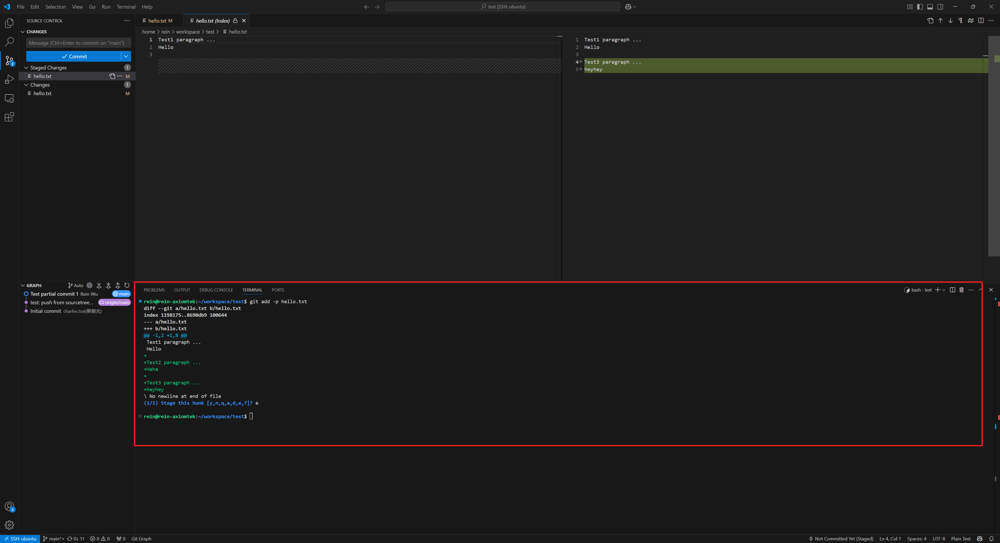
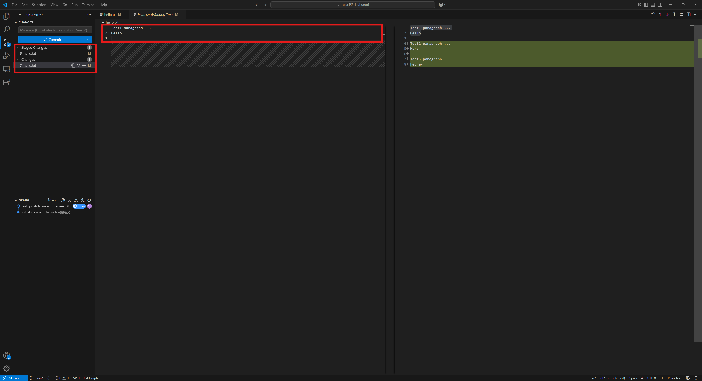

# Git FAQ

## Partial Add

這個操作主要是在要做 commit 時因**修改的部份太多導致無法寫出合適的 commit message 的標題**的時候使用。可以把修改切分成更多塊好方便下 commit message 的標題。

這個操作的缺點是無法對新增的檔案使用，對於新增的檔案可以先把檔案建立一份備份後對要版本控制的檔案做減法。等到第一版進入 git 版本控制之後再把之前備份的全部貼回去，接著再回到前面介紹的操作。

### 使用 git 指令

**範例 - git 指令**

### vscode GUI

操作步驟

1. 選取 `git tab`
2. 選取要處理的檔案開啟 `working tree`
3. 選取要 `add` 的部分後點取右鍵
4. 選取 `Stage Selected Range` 把該片段加入

#### 操作示範 - vscode GUI

#### 操作結果

## 當有衝突導致無法 checkout 到其它 branch 時的處理方法

只要 checkout 到其它 branch 時，會導致當前 working directory 的狀態跟目標 branch 發生衝突，就不能 checkout。有兩種方法可以處理這個問題

1. stash
2. commit + reset

`stash` 會把變動暫存到另外一個 `stack` 後恢復到 `HEAD` 的狀態。這個方法適合使用在**可以很快就回來繼續處理目前的事情，不會忘記目前正在做的事情**的狀況。而 `commit + reset` 的方法則是可以**利用 commit 做 memo** 等之後要回來繼續做事的時候可以先看 memo 回憶之前的狀態再 reset 到 `HEAD^` 。
