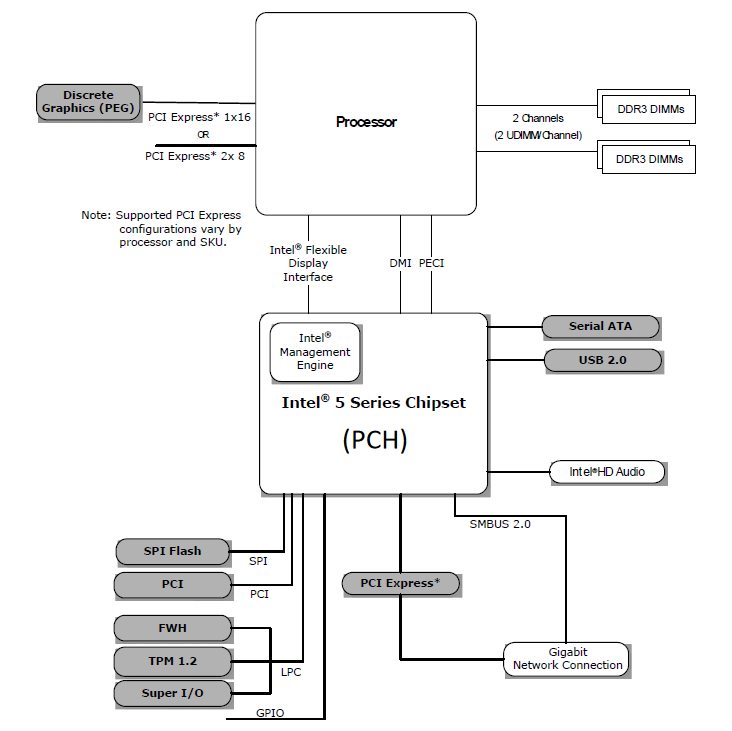
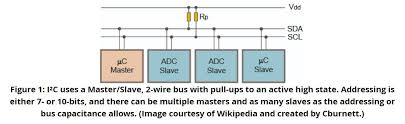

# 專業術語筆記

## 硬體

### BMC (Baseboard Management Controller)

BMC 是一個嵌入在`伺服器`或`工業電腦`中的微處理器，主要用於`監控`與`管理`硬體狀態，此外也可以監控作業系統的狀態，並執行與電源相關的管理操作。可以把它理解為一顆具備特殊用途的獨立處理器，通常會搭載一個極度輕量化的作業系統，該作業系統中運行著各種用於監控與遠端管理的服務（如硬體感測、遠端開關機、KVM-over-IP 等）。有了 BMC 架構，管理者即使在作業系統關機、當機，甚至尚未安裝 OS 的情況下，也能進行伺服器的遠端管理與故障排除。

### GPIO (General Purpose Input/Output)

GPIO 是一些直接連接到積體電路或開發板的針腳，這些針腳可以由軟體控制，作為輸入或輸出。根據連接對象，可以分成 `積體電路 GPIO` 與 `板級 GPIO`。一般在軟體開發中比較常接觸的是 `板級 GPIO`。每個 GPIO 可以被配置為 `input`、`output`、`analog` 或 `alternate function`。通常 GPIO 不會有預先固定的功能，開發者可以自定義操作方式及對應功能。

#### alternate function

`alternate function` 指 GPIO 的其他可選功能，例如 I2C, SPI, USART, CCP, PWM, Clock 等。GPIO 如何使用這些功能，取決於外部設備（peripheral）及其驅動程式的配置。

### WDT (Watchdog Timer)

`Watchdog timer` 是一個用來偵測並修復系統故障的倒數計時器。常見的工作流程是：先設定一個定時器，若系統正常執行，就會定期重置(或關閉)這個定時器以避免觸發 timeout。當 timeout 發生時，WDT 會發送一個 signal，讓系統根據 signal 進行故障通報或修復。Watchdog 通常由硬體實作並整合在晶片中，但也可以透過軟體方式來實作。

#### 常見的 watchdog 操作

- **Enable / Start**: 啟動 timer 開始倒數  
- **Kick / Feed**: 重置 timer，避免 timeout  
- **Disable / Stop**: 關閉 timer  
- **Set Timeout**: 設定多久後發生 timeout  
- **Bind Handler / Register Callback**: 設定當 timeout 發生後要執行的處理程序  
- **Query / Get Status**: 查詢 watchdog 目前的狀態  

### SoC (System on Chip)

SoC（System on Chip）是一種高度整合的晶片設計，將電腦系統中多個原本需要獨立晶片的功能（如 CPU、GPU、記憶體控制器、I/O 控制器、通訊模組等）整合到單一積體電路上。與傳統電腦系統相比，SoC 透過高度整合達到降低功耗與體積優化的效果。

#### 特點

- **高整合度**：處理器、圖形處理單元、數位訊號處理器（DSP）、影像訊號處理器（ISP）、記憶體控制器、通訊模組等可整合於單一晶片。
- **體積小、低功耗**：非常適合手機、平板、穿戴式裝置、IoT 等行動裝置。
- **低成本**：減少多顆晶片設計、封裝與主機板佈線需求。
- **應用特化**：可依應用需求設計，例如行動運算、車用電子、人工智慧或嵌入式系統。

#### 缺點

- **彈性較低**：無法像傳統架構一樣自由更換或升級單一元件（例如 GPU 或網路晶片）。
- **散熱限制**：所有功能集中於單一晶片，功耗與熱設計更具挑戰性。
- **效能升級困難**：若需要更高效能，通常需設計全新 SoC，而非單純替換部分晶片。

### PCH (Platform Controller Hub)

PCH 是 Intel 架構下的一種晶片組。隨著處理器頻率不斷提升，傳統的 FSB 成為瓶頸。為了解決這個問題，Intel 導入 **PCH 架構**，取代更舊的南北橋架構。

- **北橋**：主要負責高速 I/O，例如處理器與 RAM 之間的存取，以及高速 PCI-E 連線。  
- **南橋**：主要負責低速 I/O，例如 SATA, USB, LAN 等。

#### 架構改進
- **記憶體控制器, iGPU, 高速 PCI-E 控制器**：從北橋轉移並整合到處理器內部。  
- **PCH**：則承擔原本南橋的功能集（如 SATA, USB, 音效, 網路控制等）。  
- **處理器與 PCH 之間**：透過 DMI 連接。DMI 也是早期北橋與南橋之間的連接方式。

#### 總結
PCH 架構將高速功能集中於處理器，低速周邊功能交由 PCH 負責，成功消除了 FSB 瓶頸，使得 CPU 與記憶體、高速 I/O 之間的效能大幅提升。

#### PCH 架構圖

## 軟體

### OpenBMC

OpenBMC 是一個開源專案，其主要目的是建立一個專為 BMC 硬體設計的 `Linux 發行版（Linux distribution）`，用來提供各種伺服器遠端管理與監控功能。該專案目前由 `Linux Foundation` 主導與維護，並有多家業界廠商 (例如 IBM, Intel, Facebook, Google 等) 參與貢獻。

### U-boot (Universal Boot Loader)

[Das U-Boot: The Universal Boot Loader](https://u-boot.org/)

U-Boot 是一個`開源的`、`用在嵌入式裝置的` bootloader 。它同時是 `first-stage bootloader` 與 `second-stage bootloader` 。在安裝時可以選擇切割成兩個程式來分別扮演不同 stage 的 bootloader 也可以直接用單一程式來提供所有 stage 的功能。 U-Boot 支援了很多不同的平台，例如  M68000, ARM, Blackfin, MicroBlaze, AArch64, MIPS, Nios II, SuperH, PPC, Power ISA, RISC-V, LoongArch 與 x86 等。

#### bootloader (a.k.a. bootstrap loader)

bootloader 是一個開機過程中會使用到的小程式，它主要負責的工作是`初始化底層硬體`以及`將作業系統的 kernel 載入與啟動`。根據工作的流程通常會把負責`初始化底層硬體`的部份稱為 `first-stage bootloader` ，而負責將作業系統的 kernel 載入與啟動的部份稱之為 `second-stage bootloader` 。這兩個 stage 可以視同一個程式，也可以是兩個不同的程式。常見的 first-stage bootloader 包含 BIOS, UEFI, coreboot, Libreboot 與 Das U-Boot 等。而常見的 second-stage bootloader 則是有 GNU GRUB, rEFInd, BOOTMGR, Syslinux 與 NTLDR 等。

## 系統架構

### In-band, Side-band and Out-of-band

這三個術語是用來分類通訊的方式

| 分類 | 定義 |
| - | - |
| In-band | 與主要資料共用同一物理和邏輯通道 |
| Side-band | 與主要資料共用同一物理通道，但使用不同邏輯通道或協定 |
| Out-of-band | 使用完全獨立的物理和邏輯通道 |

#### 額外補充

物理通道就是實際對應到硬體建立的通道，邏輯通道則是通過軟體控制劃分的方式將物理通道切割產生的通道。

## 技術標準

### PFR (Platform Firmware Resilience)

PFR 是一個技術標準，由 NIST 在 2018 年發佈，標準編號為 [NIST SP 800-193](https://nvlpubs.nist.gov/nistpubs/SpecialPublications/NIST.SP.800-193.pdf)。  
該標準的重點分為三個項目：

- **Protection (保護):** 提供機制以確保平台韌體與關鍵資料的 `完整性 (integrity)`，並防止其遭到破壞。例如，確保韌體更新過程的可靠性與完整性。  
- **Detection (檢測):** 提供機制檢測平台韌體與關鍵資料是否遭到竄改，或是否從授權狀態被更改。  
- **Recovery (恢復):** 當檢測到韌體或關鍵資料遭到破壞，或透過授權機制強制恢復時，將其修復到具完整性的狀態。恢復範圍僅限於韌體與關鍵資料。  

※ 註：這裡的`完整性 (integrity)` 指的是資料或韌體經過驗證，被認為是可靠且未遭到未授權更改。  

實現方式有很多種，目前較常見的作法是利用額外的 FPGA 或 SoC 硬體，搭配特定的軟體來完成。

### I²C (Inter-Integrated Circuit) bus

I²C 是由 Philips Semiconductors（現 NXP Semiconductors）提出的一種 **短距離串列通訊協定**，用來在單一電路板上連接 **處理器、微控制器以及其他低速週邊設備**。  
它僅需兩條訊號線（SDA：資料線、SCL：時脈線），因此特別適合板內通訊。

#### 特點

- **同步架構**：由 SCL 提供時脈，所有裝置同步傳輸資料。  
- **主從架構**：由主機發起通訊，從機依位址回應。支援多主機設計。  
- **半雙工**：資料在 SDA 上單向傳輸，每次僅有一方傳送資料。  
- **多裝置支援**：每個從機有唯一位址，可同時掛載多個設備。  
- **速率模式**：標準模式 (100 kbps)、快速模式 (400 kbps)、快速模式+ (1 Mbps) 、高速模式 (3.4 Mbps)等。

**標準的架構圖如下**

### LPC (Low Pin Count) bus

LPC (Low Pin Count) 是一種低速匯流排，主要用於 IBM-compatible PC 架構中，連接 CPU 與各種低速設備。它最早由 Intel 提出，用來取代更古老的 ISA（Industry Standard Architecture）匯流排。

#### 主要應用

- **BIOS ROM**：早期透過 LPC 存取 BIOS，現今逐漸被 SPI/eSPI 標準取代。  
- **Legacy I/O device**：如序列埠、並列埠、PS/2 等，後來多被整合到 Super I/O、Embedded Controller(CPLD) 或 IPMI 晶片中。  
- **Trusted Platform Module (TPM)**：安全模組常透過 LPC 連接。  

#### 後繼規格
隨著系統整合度提升與需求變化，LPC 的角色逐漸被 **SPI** 與 **eSPI（Enhanced Serial Peripheral Interface）** 取代。  

### NTP (Network Time Protocol)

NTP 是一個 **透過網路進行時間同步** 的通訊協定，屬於 **應用層**，使用 **UDP 123 Port**。 

#### 特點
- **Master-Slave、Strata 架構**：  
  - Stratum 0：高精度時間來源 (例如 GPS、原子鐘)。  
  - Stratum 1：直接與 Stratum 0 相連的伺服器。  
  - Stratum 2/3...：透過網路層層同步的伺服器與客戶端。  
- **延遲估算與補償**：會計算網路延遲，並對本地時鐘做調整，而非直接重設。  
- **高精準度**：在理想網路環境可達毫秒 (ms) 級精度；區域網路甚至可達微秒 (µs) 級。  

## 資訊安全

### PDoS (Permanent Denial-of-Service Attacks)

PDoS 也稱作 `phlashing`，是一種 `DoS` 攻擊方式，其核心概念是攻擊目標裝置的硬體。這類攻擊並非透過物理方式，而是利用安全性漏洞覆寫負責控制硬體的韌體，進而破壞硬體功能。最著名的案例發生在 2017 年的 [BrickerBot](https://en.wikipedia.org/wiki/BrickerBot) 攻擊事件。

## 商業術語

### Linux distribution

簡單來說，Linux distribution（發行版）就是將 Linux 核心（Kernel）搭配一系列預先整合好的套件與工具，打包成一個可以安裝使用的作業系統。
這樣使用者就不需要從零開始安裝或設定每個元件，而是可以直接使用一個預設良好的系統環境，再依需求進一步調整。
